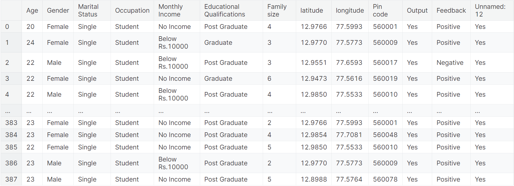
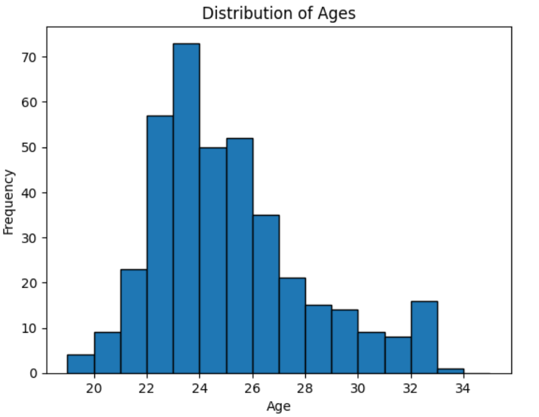
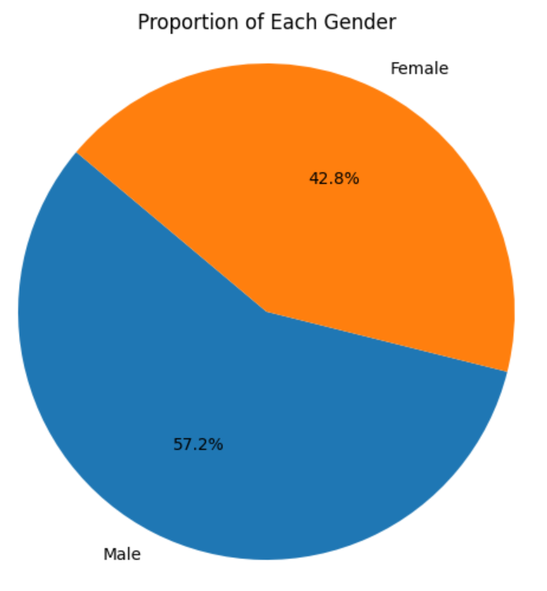
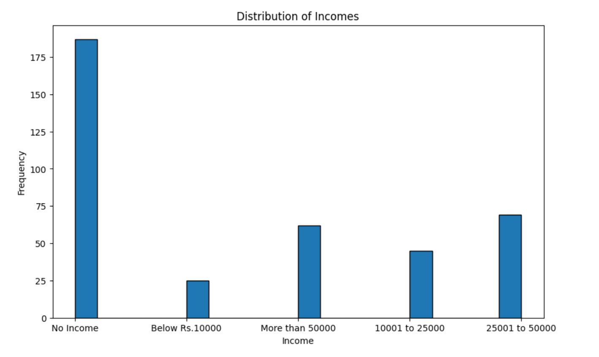

## “项目名称”进展报告

> 撰写时间：2024年4月20日
>
> 撰写人：邱聖邦

### 1. 数据获取及预处理

#### 1.1 数据来源
> 本项目组使用的是一个在线食品订购数据集，其源自一个活跃的在线食品订购平台-Ebay。本数据集记录了，在一段时间内其客户的各种信息。数据集规模适中，包含数千条记录，每个记录涵盖了多个字段，旨在全面反映客户的特征和订购行为。

#### 1.2 数据说明
> 本数据集主要涵盖了三个方面的信息：一是人口统计学信息，包括年龄、性别、婚姻状况、职业、月收入、教育程度和家庭规模；二是位置信息，包括纬度、经度和邮政编码；三是订单详情，如订单状态和顾客反馈。这些字段不仅详细描述了客户的基本情况，还反映了他们的订购习惯和满意度。

#### 1.3 数据预处理
> 在数据预处理方面，我们小组已经进行了一系列工作以确保数据的质量和可用性。对于噪声数据，我们小组采用了数据清洗和标准化方法，以消除异常值和错误条目。对于缺失值，我们根据字段的重要性和数据的分布情况，采取了插值或删除记录的策略。同时，我们对数据进行了探索性分析，以理解数据的分布和特征，为后续的数据分析和建模工作奠定了基础。

### 2. 数据分析与可视化

> 通过观察数据集，我们得到数据集的基本特征（图片请看github：）
 

### 3. 模型选取

> 我们项目组解决的问题主要关注,探究人口统计学与位置因素对在线食品订购行为的影响，分析顾客反馈以优化服务质量，以及预测顾客的偏好和行为。针对上述问题问题，我们项目组考虑使用以下三类模型进行数据挖掘：

> <1>为了探究人口统计学与位置因素对订购行为的影响，我们可以使用逻辑回归模型。逻辑回归模型适用于处理分类问题，可以分析不同因素对订单状态（如确认、交付等）的影响，帮助我们理解哪些因素最可能影响顾客的订购决策。

> <2>对于分析顾客反馈的问题，我们项目组使用文本挖掘技术，结合情感分析模型。情感分析模型能够识别文本中的情感倾向，从而评估顾客对服务的满意度。通过对反馈文本进行深入挖掘，可以发现服务中存在的问题，并提出针对性的改进措施。

> <3>为了预测顾客的偏好和行为，我们考虑使用机器学习中的分类或聚类模型。分类模型如决策树、随机森林或支持向量机，可以根据已知数据预测新顾客的订购偏好；而聚类模型如K-means，则可以帮助我们发现顾客群体的潜在分类，进一步理解不同顾客群体的特征和需求。

> 通过使用以上三类模型架构，我们小组可以从多角度对项目数据集进行挖掘。逻辑回归模型易于解释，适用于探究影响因素；情感分析模型能够处理文本数据，深入挖掘顾客反馈；而机器学习的分类和聚类模型则能够基于大量数据进行预测和分类，为平台提供更精准的顾客分析和服务优化建议。通过综合运用这些模型，我们可以从多个角度对在线食品订购数据集进行深入挖掘和分析。

### 4. 挖掘实验的结果

> 生成年龄分布图，以更直观地观察数据构成
 

> 生成性别图，帮助我们更好地分析分析数据集中基于性别的模式和行为。
 

> 生成收入图，帮助我们更直观地观察收入对购物模型的影响
 

> 通过对数据集的各项因素生成直观的图形化图像，我们更加直观地观察到了数据集的构成组合，并得出以下结论：

> <1>性别在在线食品订购行为中扮演着重要的角色。男性和女性在食品选择、口味偏好以及订购频率上可能存在差异。女性可能更倾向于为家庭订购，因此家庭规模较大的情况下，女性的订购频率和订单金额可能会相对较高。

> <2>收入是影响在线食品订购行为的关键因素。一般来说，收入较高的顾客可能更倾向于订购价格较高、品质更优的餐品，也可能更愿意尝试新的餐厅和菜品。同时，高收入顾客可能对配送速度和服务质量有更高的要求，这也会影响他们的订购决策。相反，收入较低的顾客可能更注重价格因素，选择价格适中、性价比高的餐品。

> <3>其他如年龄、职业、教育程度等特征也可能对在线食品订购行为产生影响。例如，年轻人可能更偏爱新颖、时尚的餐品，而中老年人可能更注重食品的营养和健康。职业和教育程度也可能影响顾客的口味偏好和订购习惯。

### 5. 系统交互设计

> 我们项目组计划利用上述数据集，通过训练网络模型来深入挖掘用户购物行为背后的特征关联。针对用户输入中可能出现的缺省数据，我们将利用模型已有的学习成果，通过其他已知特征进行智能预测和填充。这一步骤的目的在于确保模型在处理用户数据时能够更全面、准确地把握用户的个性化特征。最终，我们将基于这些特征预测用户的购物倾向，并为其打分，以此为依据为用户提供个性化的购物推荐和精准的市场分析。

> 针对UI界面的设计，我们小组计划使用qt。用户只需输入部分个人特征，即可得到网络对其他特征的预测，并输出购物倾向分数。

### 6. 存在的问题

> 我们项目小组，目前存在模型选择可能不够精准，以及用户输入缺省数据处理策略有待优化等问题。需进一步完善数据清洗和特征工程，精细调整模型参数，同时优化缺省数据处理方法，以提高预测准确度和用户体验。

### 7. 下一步工作
> 我们小组将继续优化数据预处理流程，加强特征选择和转换，提升数据质量。
> 同时，我们将引入机器学习的网络模型，实现对特征数据的预测。
> 此外，将完善缺省数据处理策略，确保用户输入信息的完整性和准确性。
> 最后实现qt界面的实现

### 8. 任务分配与完成情况
> 完成情况：我们小组已经完成了数据的清洗、分析工作。并且对网络模型进行了初步的选择，观察的模型的预测结果。

> 接下来，我们小组的任务分配为：<1>邱聖邦实现对模型的优化、参数的调整。<2>宋宝临负责参数的优化以及文档的编写。<3>王海腾负责界面的实现以及数据的分析工作